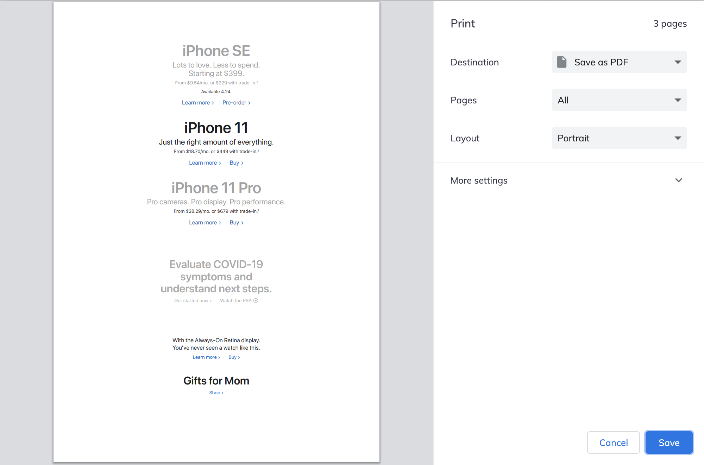
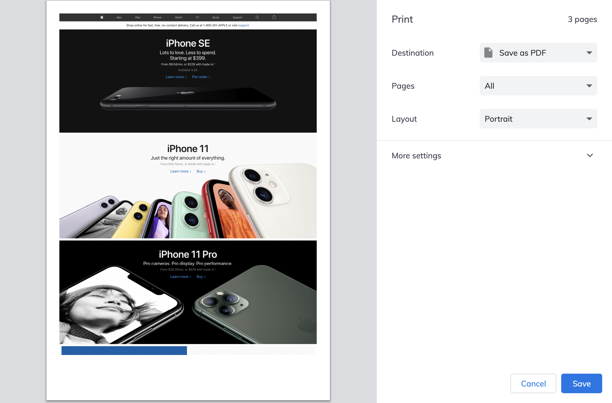
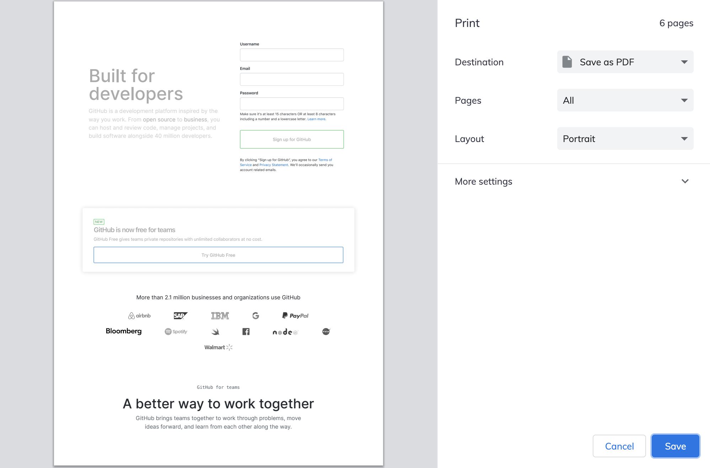
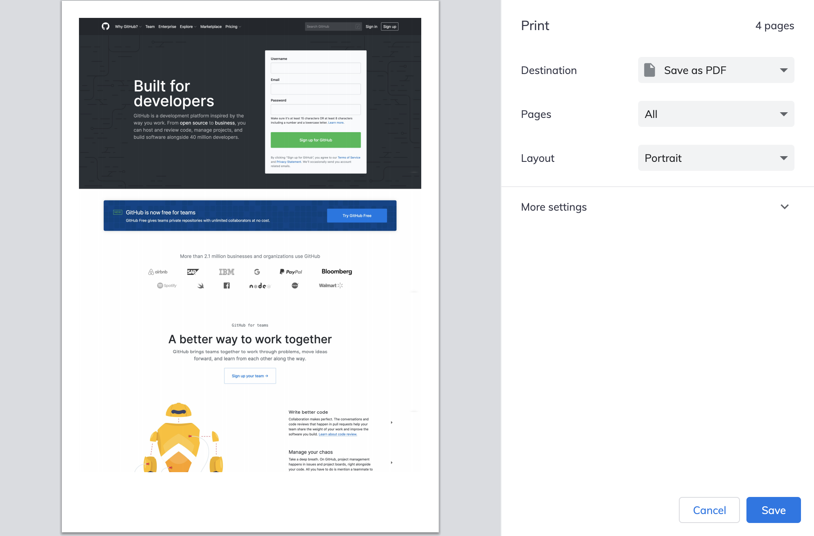
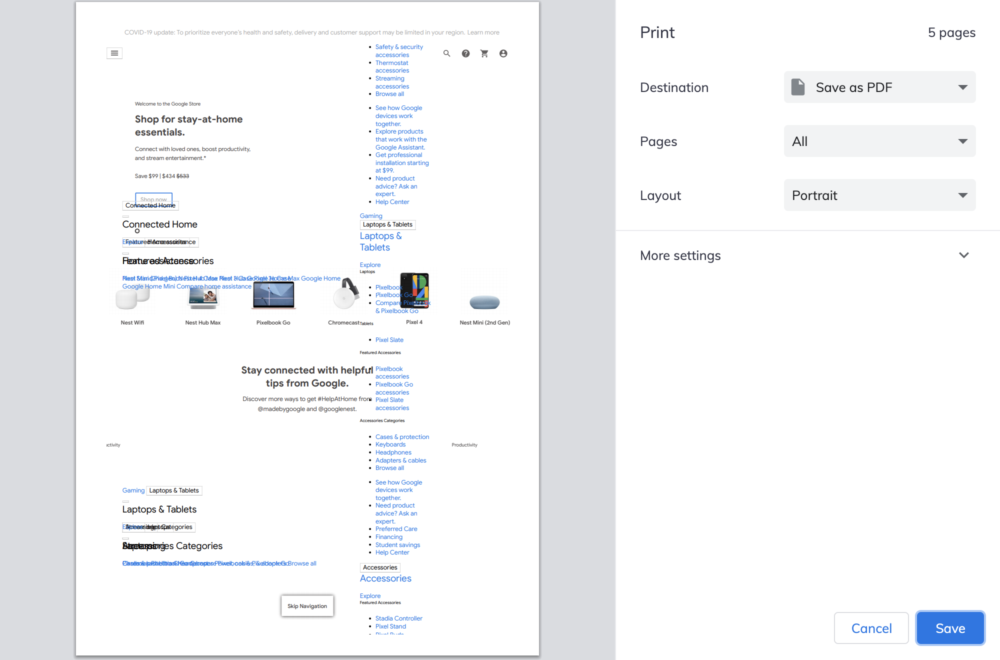
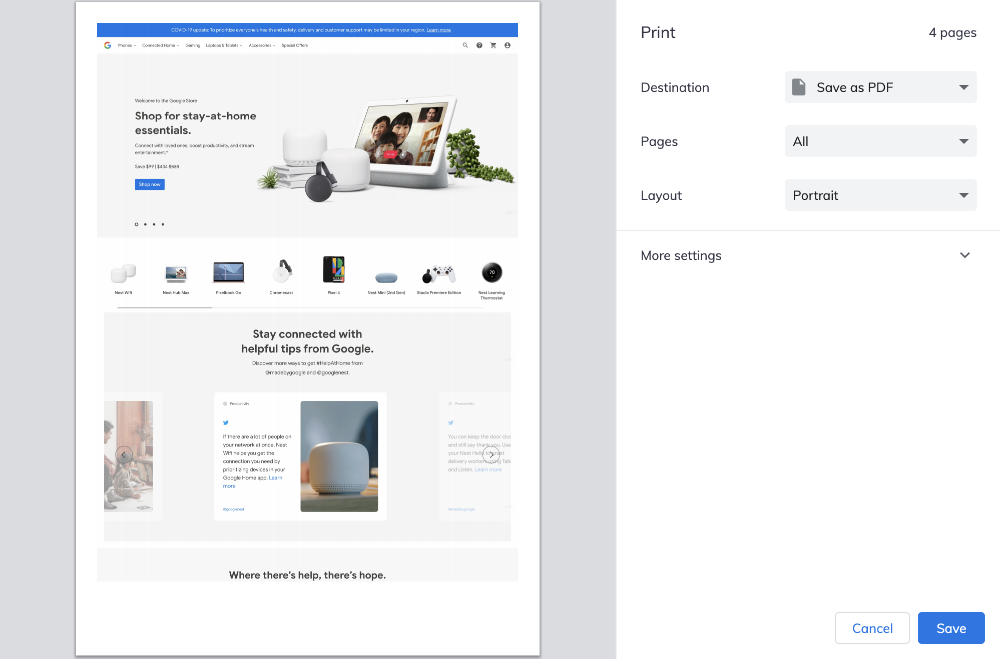

# PDFit

**PDFit is a Chrome extension to convert a website to PDF, splitting it into individual A4 pages.**

**_What you see is what you get!_**

If you have ever tried printing a webpage or converting it to a multipage PDF, you've probably encountered this issue: More often than not what you end up printing looks quite different to the actual website.

This extension is for when your browser's built-in print function fails you.

How can it be that in a world of self-driving cars and quantum computers, you still can't properly print websites? That is why, together with my good friend [Alexandra](https://github.com/alexandrapurcarea), I decided to tackle this very problem and develop a simple Chrome extension that enables the printing of webpages as is.

## Usage

To convert the current tab to PDF, just click on the extension in your address bar and a print dialogue will open in a pop-up window. You can now either print the website or save it as a pdf.

## Installation

1. Clone the repo
2. Open Chrome
3. Go to `chrome://extensions`
4. Enable Developer mode in the top right corner
5. Load unpacked extension
6. Select the directory that was created when cloning this repo

## Examples

|                                                  |       Default Chrome print dialogue        |           PDFit print dialogue           |
| :----------------------------------------------: | :----------------------------------------: | :--------------------------------------: |
|        [apple.com](https://www.apple.com)        |         |         |
|       [github.com](https://www.github.com)       |        |        |
| [store.google.com](https://www.store.google.com) |  |  |

## Todo

- [ ] Dynamically slice the screenshots to completely fill the A4 pages
- [x] Create a logo/icon
- [x] Automatically open the print dialogue in new window
  - [x] Close window once printed
- [x] Only capture the middle portion of the screen. That way the navbar will be captured only once.
- [x] Delete duplicated section at the bottom of the document

## Contributing

Pull requests are welcome. For major changes, please open an issue first to discuss what you would like to change.

## License

[MIT](https://choosealicense.com/licenses/mit/)

## Attributions

Logo icon made by <a href="https://www.flaticon.com/authors/freepik" title="Freepik">Freepik</a> from <a href="https://www.flaticon.com/" title="Flaticon">www.flaticon.com</a>
